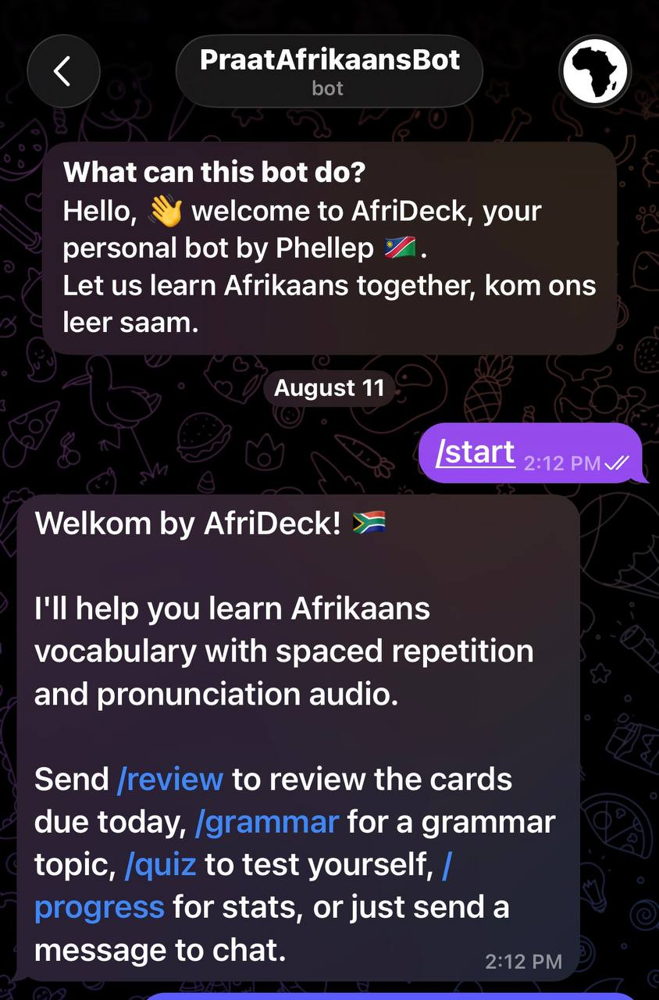
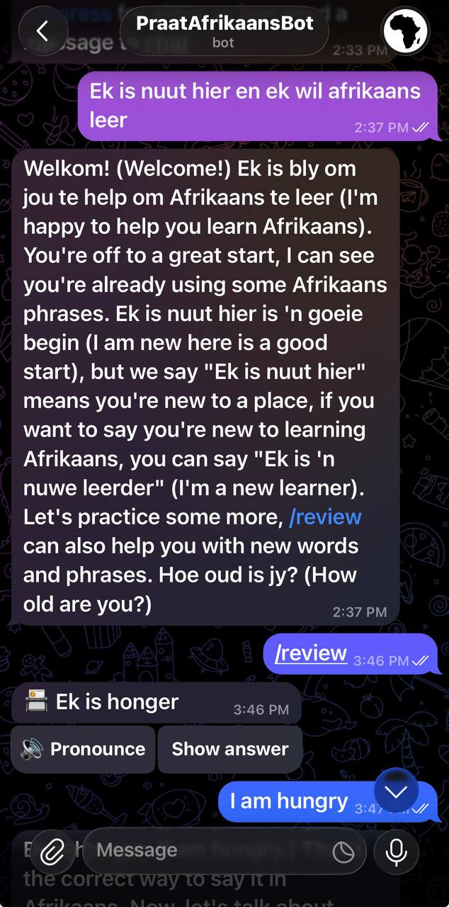
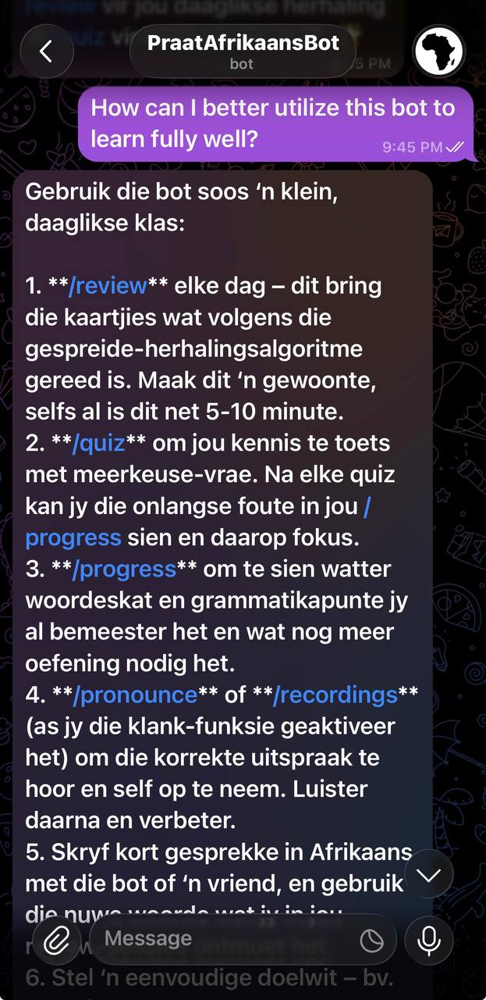
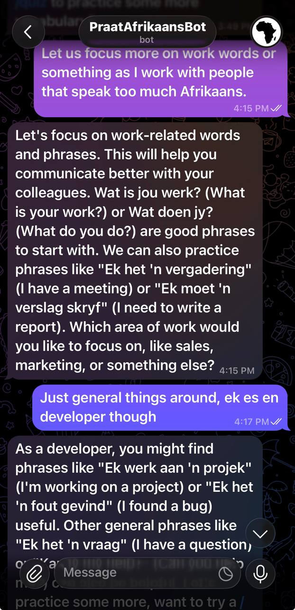

# AfriDeck 🇳🇦

A personal Afrikaans-learning Telegram bot with spaced repetition flashcards, grammar lessons, quizzes,
pronunciation audio, and free-form chat. Built entirely on free tiers.

## Screenshots

| | |
|---|---|
|  |  |
| `/start` | `/review`, one card at a time |
|  |  |
| Free chat: how to use the bot | Free chat: steering toward specific vocabulary |

## Features

- **Multi-user**: anyone who messages the bot gets their own SM-2 progress, streak, and mastery
  stats. Vocabulary and grammar content is shared (seeded once); scheduling, review history, and
  recordings are private per person. New cards are introduced gradually, up to 20/day per user
  (like Anki's daily new-card limit), rather than dumping the full 363-card catalog on day one
- **`/review`**: SM-2 spaced repetition over 363 cards across 13 vocabulary decks (greetings,
  everyday, work, numbers, time, food, travel, family, home, weather/nature, money, health,
  technology) and a grammar deck, one card at a time, with a running "N left today" count.
  Answering in free text instead of tapping a button (e.g. typing "it means small") still gets
  graded in context by the chat handler, though only the buttons record the actual review
- **`/grammar`**: menu of 20 core Afrikaans grammar topics, each with a structured explanation and
  examples. Reviewing a grammar card via `/review` shows the same full lesson, not a truncated
  version
- **`/quiz`**: multiple choice, kept separate from review scheduling so it doesn't distort timing
- **`/progress`**: cards mastered, due today, and a review streak
- **`/pronounce`, voice notes, `/recordings`**: reference pronunciation (cached TTS, shared) and
  your own practice recordings (private per person), optional (needs Cloudflare R2). A typo that
  misses gets a "did you mean" suggestion instead of a flat not-found
- **Free chat**: anything that isn't a command gets a Groq-backed reply, with short-term memory per
  chat
- **Daily reminder**: a Vercel Cron job checks every user's due count and nudges anyone who has
  cards waiting
- **`/help`, `/decks`**: full command reference, and a per-deck card count for orientation

## Stack

Telegram Bot API · Vercel (serverless functions + cron) · Upstash Redis · Cloudflare R2 · Groq
(openai/gpt-oss-120b) · Google Translate TTS (unofficial)

## Setup

1. Create a bot via [@BotFather](https://t.me/BotFather) → `BOT_TOKEN`
2. `npm install`, then copy `.env.example` → `.env` and fill in credentials:
   - `WEBHOOK_SECRET`: any random string
   - `UPSTASH_REDIS_REST_URL` / `UPSTASH_REDIS_REST_TOKEN`: free Redis at [upstash.com](https://console.upstash.com/)
   - `GROQ_API_KEY`: free at [console.groq.com](https://console.groq.com/)
   - `R2_*`: optional, Cloudflare R2 for audio (needs a card on file even on the free tier)
   - `CRON_SECRET`: optional, any random string, guards the otherwise-public daily reminder endpoint
3. Seed the vocabulary deck:
   ```
   npm run build-wordlist && npm run generate-sentences && npm run seed-redis
   ```
4. Seed the grammar deck:
   ```
   npm run generate-grammar-lessons && npm run seed-grammar
   ```
5. Deploy (`npx vercel --prod`, or connect the repo at vercel.com) and add the same env vars there
6. Register the webhook:
   ```
   WEBHOOK_URL=https://<your-deployment>/api/webhook npm run set-webhook
   ```

Everything except Redis degrades gracefully if unconfigured: audio and chat reply with a friendly
"not set up yet" instead of breaking anything else.

Content (vocab examples and grammar explanations) is Groq-generated, then spot-checked by hand
before seeding: regeneration isn't deterministic and has produced real errors more than once
(mistranslations, invented grammar rules that contradicted their own examples), so treat any
regenerated content as a draft to verify, not a finished deck.

## Project layout

```
api/webhook.ts             Telegram webhook entrypoint
api/cron/daily-reminder.ts  Daily due-cards nudge
lib/bot.ts                 Command handlers and all bot flows
lib/cards.ts, sm2.ts        Card storage + SM-2 scheduling
lib/quiz.ts, chat.ts, grammar.ts, audio.ts, r2.ts, tts.ts, redis.ts, slug.ts, types.ts
scripts/                   One-off content generation, seeding, and migration scripts
data/                      Curated + generated deck content
```
