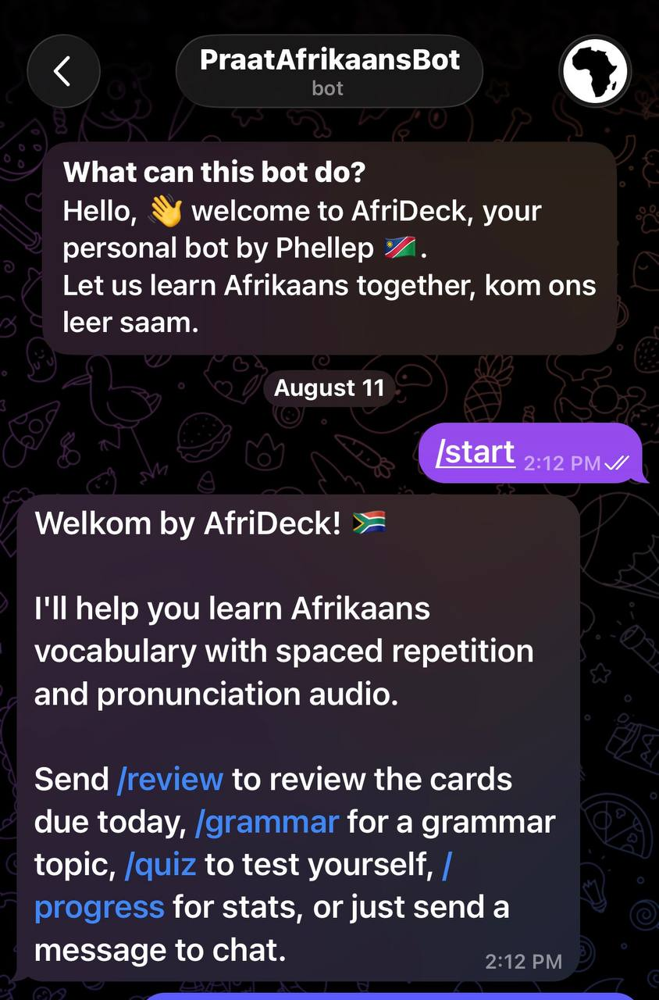
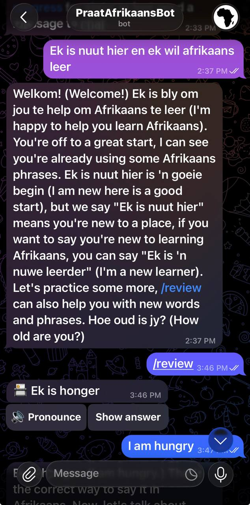
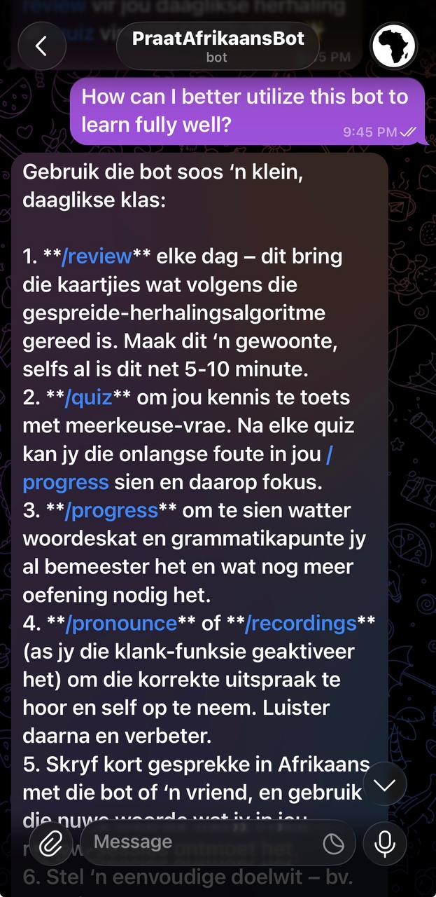
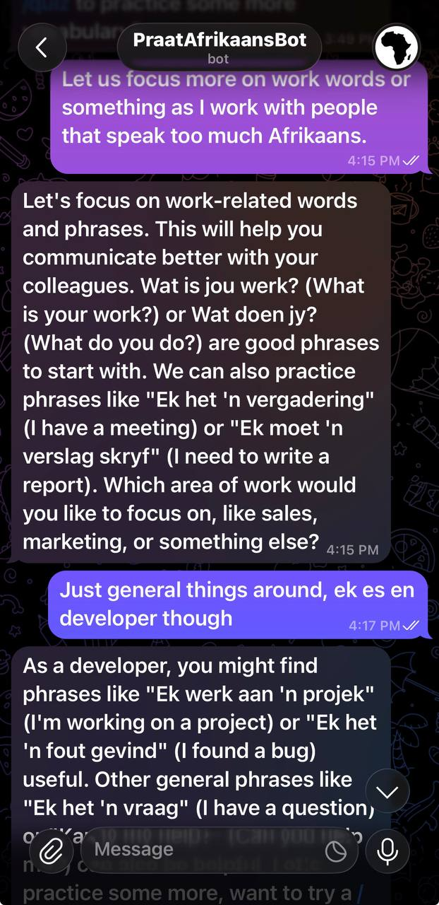

# AfriDeck 🇳🇦

A personal Afrikaans-learning Telegram bot with spaced repetition flashcards, grammar lessons, quizzes,
pronunciation audio, and free-form chat. Built entirely on free tiers.

## Screenshots

| | |
|---|---|
|  |  |
| `/start` | `/review`, one card at a time |
|  |  |
| Free chat: how to use the bot | Free chat: steering toward specific vocabulary |

## Features

- **Multi-user**: anyone who messages the bot gets their own SM-2 progress, streak, and mastery
  stats. Vocabulary and grammar content is shared (seeded once); scheduling, review history, and
  recordings are private per person. New cards are introduced gradually, up to 20/day per user
  (like Anki's daily new-card limit), rather than dumping the full 363-card catalog on day one
- **`/review`**: SM-2 spaced repetition over 363 cards across 13 vocabulary decks (greetings,
  everyday, work, numbers, time, food, travel, family, home, weather/nature, money, health,
  technology) and a grammar deck, one card at a time, with a running "N left today" count.
  Replying to a card with your answer (instead of tapping a button) grades it and records the
  review automatically, good/again depending on correctness; the buttons are still there for
  manual Again/Hard/Good/Easy nuance
- **`/grammar`**: menu of 20 core Afrikaans grammar topics, each with a structured explanation and
  examples. Reviewing a grammar card via `/review` shows the same full lesson, not a truncated
  version
- **`/quiz`**: multiple choice, kept separate from review scheduling so it doesn't distort timing
- **`/progress`**: cards mastered, due today, and a review streak
- **`/pronounce`, voice notes, `/recordings`**: reference pronunciation (cached TTS, shared) and
  your own practice recordings (private per person), optional (needs Cloudflare R2). A typo that
  misses gets a "did you mean" suggestion instead of a flat not-found
- **Free chat**: anything that isn't a command gets a Groq-backed reply, with short-term memory per
  chat
- **Daily reminder + word of the day**: one message per user per day (hard-guarded against
  duplicate sends, even if the cron fires more than once), always including a detailed Word of
  the Day explanation (same word for everyone, rotates through the vocab catalog), plus a due-card
  nudge if there's anything waiting. `/word` looks today's word up on demand
- **`/help`, `/decks`**: full command reference, and a per-deck card count for orientation

## Stack

Telegram Bot API · Vercel (serverless functions + cron) · Upstash Redis · Cloudflare R2 · Groq
(openai/gpt-oss-120b) · Google Translate TTS (unofficial)

Everything except Redis degrades gracefully if unconfigured: audio and chat reply with a friendly
"not set up yet" instead of breaking anything else.

Content (vocab examples, grammar explanations, word-of-the-day writeups) is Groq-generated, then
spot-checked by hand before seeding: regeneration isn't deterministic and has produced real errors
more than once (mistranslations, invented grammar rules that contradicted their own examples, and
repeated false claims that Afrikaans has grammatical gender, which it doesn't, so that specific
claim is hard-filtered out of word-of-the-day text rather than trusted to a prompt instruction
alone). Treat any regenerated content as a draft to verify, not a finished deck.

## Project layout

```
api/webhook.ts             Telegram webhook entrypoint
api/cron/daily-reminder.ts  Daily word of the day + due-cards nudge, deduped per user per day
lib/bot.ts                 Command handlers and all bot flows
lib/cards.ts, sm2.ts        Card storage + SM-2 scheduling
lib/quiz.ts, chat.ts, grammar.ts, word-of-day.ts, review-session.ts
lib/audio.ts, r2.ts, tts.ts, redis.ts, slug.ts, types.ts
scripts/                   One-off content generation, seeding, and migration scripts
data/                      Curated + generated deck content
```
